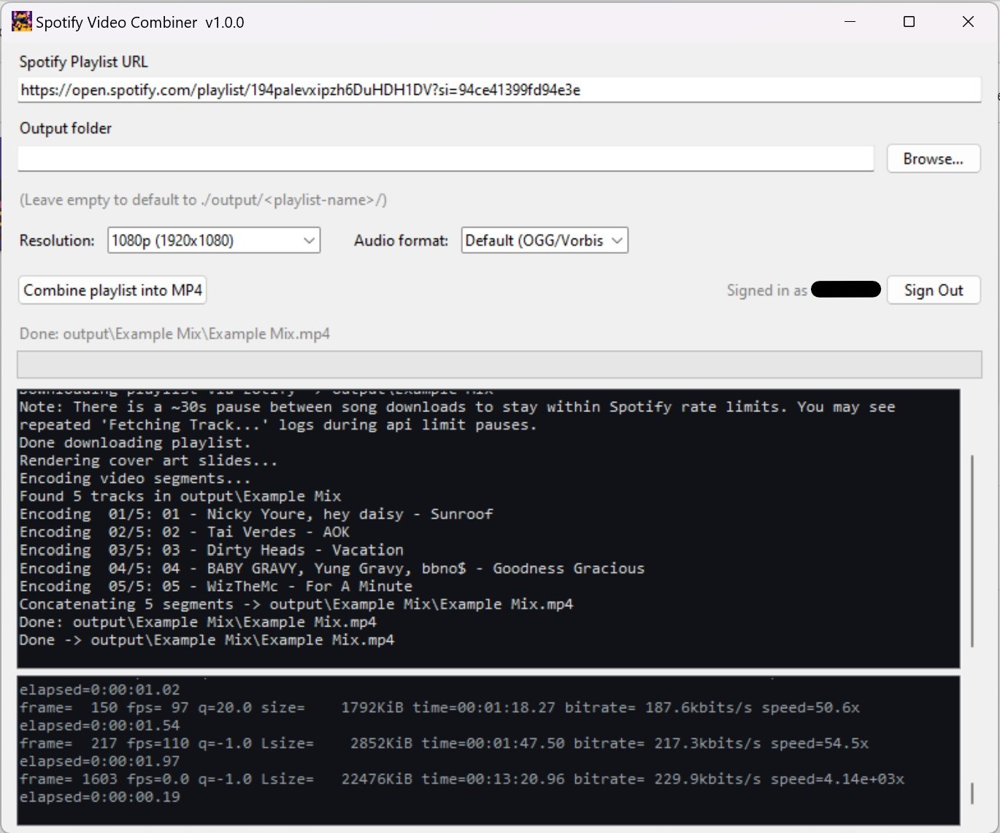
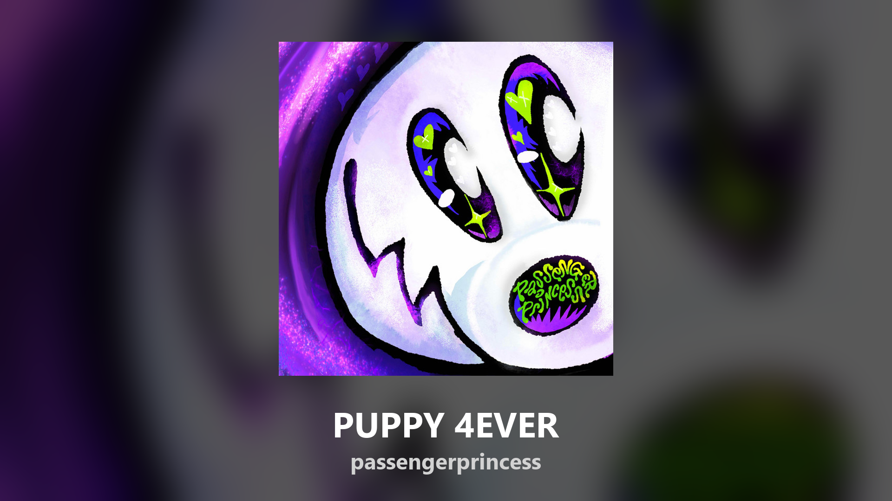

# Spotify Video Combiner

Turn any Spotify playlist into a single video file! This tool downloads the audio and cover art for every track in a Spotify playlist and combines them into one seamless video. 

This is perfect for **playing Spotify playlists in VRChat worlds** — just upload the final video to YouTube as an unlisted video and paste the link into a VRChat video player.

The final video features:
- High-quality audio for every track.
- A beautiful 1080p slide showing the track's cover art, title, and artist.
- Seamless transitions between songs, in exact playlist order.

*(Screenshot of app)*

*(Example song slide image)*

## Getting Started

Using Spotify Video Combiner is easy and doesn't require any technical knowledge if you use the Windows application.

### 1. Download the App (Windows)

1. Go to the [Releases page](https://github.com/OstlerDev/spotify-video-combiner/releases).
2. Download the latest `svc-gui.exe` file.
3. Double-click the downloaded file to open the application. There is nothing to install!

### 2. Sign In to Spotify

You will need a Spotify account to use this tool.
1. Open the application and click the **Sign In** button.
2. A web browser will open taking you to the Spotify login page.
3. Log in with your Spotify account and authorize the application.
4. You only need to do this once! The app will securely remember your sign-in for future use.

*(Note: Non-premium accounts are limited to **160kbps**, Premium accounts get full **320kbps** audio).*

### 3. Create Your Video

1. Copy the link to any Spotify playlist (e.g., `https://open.spotify.com/playlist/...`).
2. Paste the link into the application.
3. Click the button to start the process!
4. The app will download the tracks and create the video. This might take a few minutes depending on the length of the playlist.
5. Once finished, you will find your new `.mp4` video ready to watch or upload.

---

## Tips for VRChat & YouTube

- **YouTube Limits:** YouTube has a **12-hour video duration limit** for verified accounts, and 15 minutes for unverified accounts. Make sure your playlist isn't too long!
- **Upload as Unlisted:** When uploading to YouTube, set the privacy to **Unlisted**. This means anyone with the link can watch it, but it won't show up in public search results.
- **Playing in VRChat:** Simply copy your unlisted YouTube video link and paste it into any video player in VRChat. The video format is optimized to work perfectly with VRChat players.

---

## Advanced Users

For advanced users, developers, or those on macOS/Linux, this tool offers a Command Line Interface (CLI) and flexible installation options.

- **[Command Line Interface (CLI) Documentation](CLI.md)** - Learn how to use the `svc` command-line tool, script downloads, and understand the working directory layout.
- **[Development and Manual Installation](CLI.md#manual-installation)** - Instructions for installing via Python, building from source, and running tests.

---

## Legal Note

The audio downloader uses your own Spotify account credentials to stream and decrypt audio, which is in a grey area with respect to Spotify's Terms of Service. This project is for personal, archival, and accessibility use only. **Do not redistribute the resulting MP4s.**

## License

[MIT](LICENSE)
